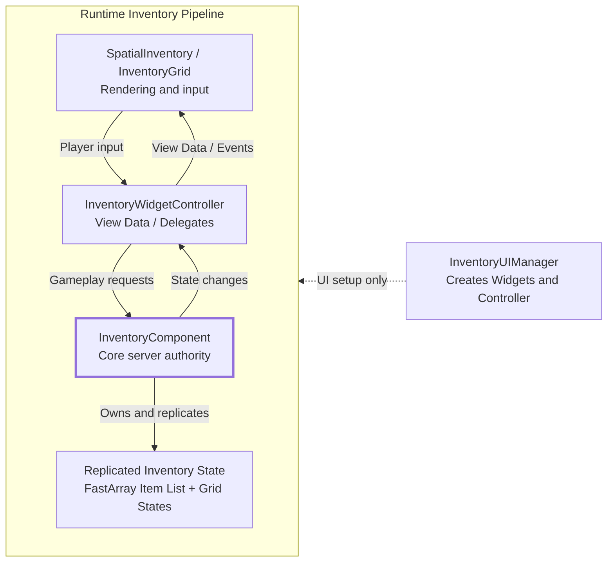

# Aura | UE 5.6 GAS Top-Down Action RPG Systems Prototype

**English** | [简体中文](README.zh-CN.md)

Aura is a top-down Action RPG project built with **Unreal Engine 5.6, C++, and the Gameplay Ability System (GAS)**. It focuses on combat, character progression, multiplayer replication, UI, and runtime performance.

## Demos

### Gameplay

  

Video: [Aura Gameplay Systems Demo](https://youtu.be/y_uQL8ulQLg)

### Inventory

  

Video: [Replicated Spatial Inventory Update](https://www.youtube.com/watch?v=ghusU05mUH0)

## My contributions

### Extensions beyond the courses

Beyond the course material, I made the following changes:

- I refactored the inventory architecture built during the spatial inventory course, separating item data, server operations, grid state, and UI. The new `InventoryGridManager`, `InventoryUIManager`, and `InventoryWidgetController` keep authoritative state out of the Widgets, which now handle only display and input.
- I built the `SimpleObjectPool` plugin on top of `UWorldSubsystem`. It supports configurable preallocation, on-demand growth, manual release, and delayed release. Before a pooled projectile is reused, the system resets its collision, movement, homing, audio, and damage state.
- I moved the course's Click-to-Move logic into a standalone `AutoMoveComponent`. A short ground click asks the server to calculate a path and replicate it to the client. Holding the mouse moves the character directly and also cancels requests and discards stale paths.
- I extended the character build UI. The Attribute Menu supports local previews, point-by-point undo, confirmation, and rollback on close. The Spell Menu uses a two-stage equip flow: select an ability, then select a compatible slot. Both menus are draggable, cache their instances, and can be opened and closed repeatedly.
- I added Health/Mana pickup prompts and camera obstruction fading so the character and status changes remain visible from the top-down camera.

### Course project and UE 5.6 migration

Aura's core systems are based on [*Unreal Engine 5 - Gameplay Ability System - Top Down RPG*](https://www.udemy.com/course/unreal-engine-5-gas-top-down-rpg/). I followed the course to implement GAS combat, abilities, progression, AI, and UI, then migrated the project to **UE 5.6**.

- Built the `AbilitySystemComponent`, `AttributeSet`, `GameplayTags`, and `InputTag` input flow, along with `GameplayEffect` Cost, Cooldown, and Attribute replication.
- Implemented three active abilities: **FireBolt, Electrocute, and Arcane Shards**. I also implemented three equippable passive abilities: **Halo of Protection, Life Siphon, and Mana Siphon**.
- Built a data-driven damage pipeline covering four damage types and resistances, armor penetration, blocking, critical hits, Debuffs, knockback, death impulse, radial damage, and XP rewards.
- Implemented XP/Level, Attribute Points, Spell Points, and the **Locked → Eligible → Unlocked → Equipped** spell book state flow.
- Built the Elementalist, Warrior, and Ranger enemy framework, with Behavior Tree support for melee, ranged attacks, Enemy FireBolt, and Summon.
- Connected Health, Mana, XP, ability slots, the spell book, the Attribute Menu, and pickup feedback UI through `WidgetController` and Delegates.

The course uses an earlier UE5 version, and some APIs have changed in UE 5.6. I worked through those differences using the official documentation and engine interfaces.

For example, Dynamic Spec Source Tags now use `GetDynamicSpecSourceTags()`, while runtime target Tags on a `GameplayEffect` use `UTargetTagsGameplayEffectComponent`. I also completed `NetSerialize` and deep-copy support for the custom `GameplayEffectContext`, so block, critical hit, Debuff, knockback, and death impulse data replicate correctly.

## Architecture and performance testing

### Replicated spatial inventory

The inventory started from [*Unreal Engine 5 C++ Inventory Systems*](https://www.udemy.com/course/unreal-engine-5-inventory-systems/). As the interaction and replication logic grew, I separated gameplay data, server validation, network replication, and the UI lifecycle. Widgets now handle only display and input. Every inventory change goes through `InventoryComponent` for server validation.

<strong>Layer responsibilities</strong>

- **`FInvSS_ItemManifest` / `UInvSS_InventoryItem`:** Define item types, Fragments, dimensions, and stacking rules, and store runtime instance data.
- **`FInvSS_FastArray`:** Replicates incremental changes to the item list and handles client-side add/remove callbacks.
- **`UInvSS_InventoryComponent`:** Provides the server-authoritative entry point and validates pickup, drop, use, split, drag-and-drop, and swap requests.
- **`UInvSS_InventoryGridManager`:** Stores each category's grid configuration, slot occupancy, parent slots, stack counts, and replicated revision number.
- **`UInvSS_InventoryUIManager`:** Manages the lifecycle of local menus, Controllers, prompts, action popups, and item description windows.
- **`UInvSS_InventoryWidgetController`:** Converts replicated state into View Data and Delegates, then forwards player requests to the gameplay layer.
- **`UInvSS_SpatialInventory` / `UInvSS_InventoryGrid`:** Handle only category switching, grid rendering, drag-and-drop previews, and input collection.

### Object pool benchmark

The benchmark uses FireBolt and runs **5 rounds × 500 Actors** for both Spawn/Destroy and pooled reuse. The timing results match the CPU scopes exported from Unreal Insights.

| Metric | Spawn / Destroy | Object Pool | Result |
|---|---:|---:|---:|
| Acquire Total | 872.717 ms | 62.426 ms | **92.8% lower** |
| Release Total | 138.005 ms | 22.615 ms | **83.6% lower** |
| Runtime Total | 1010.722 ms | 85.041 ms | **91.6% lower** |
| Including Cold Setup | 1010.722 ms | 191.893 ms | **81.0% lower** |

Full setup, per-round results, and Insights data: [ObjectPool Benchmark](Plugins/SimpleObjectPool/TestResults/ObjectPoolBenchmark.md)

## Features and source code

| Feature | Main implementation |
|---|---|
| **GAS and InputTag** | [ASC.h](Source/Aura/Public/Components/AbilitySystem/AuraAbilitySystemComponent.h), [ASC.cpp](Source/Aura/Private/Components/AbilitySystem/AuraAbilitySystemComponent.cpp), [GameplayTags](Source/Aura/Private/AuraGameTagManager.cpp), [InputComponent](Source/Aura/Public/Input/AuraInputComponent.h) |
| **Attributes and progression** | [AttributeSet](Source/Aura/Public/Components/AbilitySystem/AuraAttributeSet.h), [PlayerState](Source/Aura/Public/Player/AuraPlayerState.h), [LevelUpInfo](Source/Aura/Public/Components/AbilitySystem/Data/LevelUpInfo.h) |
| **Damage and Effect Context** | [Damage Ability](Source/Aura/Private/Components/AbilitySystem/Ability/AuraDamageGameplayAbility.cpp), [ExecCalc](Source/Aura/Private/Components/AbilitySystem/ExecCalc/ExecCalc_Damage.cpp), [Effect Context](Source/Aura/Public/AuraAbilityTypes.h), [NetSerialize](Source/Aura/Public/AuraAbilityTypes.cpp) |
| **Active abilities** | [FireBolt](Source/Aura/Private/Components/AbilitySystem/Ability/AuraFireBolt.cpp), [Electrocute](Source/Aura/Private/Components/AbilitySystem/Ability/Electrocute.cpp), [Arcane Shards](Source/Aura/Private/Components/AbilitySystem/Ability/ArcaneShard.cpp) |
| **Passive abilities** | [Passive Ability](Source/Aura/Private/Components/AbilitySystem/Ability/AuraPassiveAbility.cpp), [Passive Niagara](Source/Aura/Private/Components/AbilitySystem/Passive/PassiveNiagaraComponent.cpp) |
| **Spell book and ability progression** | [ASC](Source/Aura/Private/Components/AbilitySystem/AuraAbilitySystemComponent.cpp), [AbilityInfo](Source/Aura/Public/Components/AbilitySystem/Data/AbilityInfo.h), [Spell Menu Controller](Source/Aura/Private/UI/WidgetController/AuraSpellMenuWidgetController.cpp) |
| **Enemy AI and summoning** | [Enemy](Source/Aura/Private/Character/AuraEnemy.cpp), [AI Controller](Source/Aura/Private/AI/AuraAIController.cpp), [Summon Ability](Source/Aura/Private/Components/AbilitySystem/Ability/AuraSummonAbility.cpp) |
| **Multiplayer Click-to-Move** | [AutoMoveComponent.h](Source/Aura/Public/Components/Player/AutoMoveComponent.h), [AutoMoveComponent.cpp](Source/Aura/Private/Components/Player/AutoMoveComponent.cpp), [PlayerController](Source/Aura/Private/Player/AuraPlayerController.cpp) |
| **UMG / WidgetController** | [WidgetController](Source/Aura/Public/UI/WidgetController/AuraWidgetController.h), [Overlay Controller](Source/Aura/Private/UI/WidgetController/AuraOverlayWidgetController.cpp), [AuraUserWidget](Source/Aura/Public/UI/Widget/AuraUserWidget.h) |
| **Attribute / Spell Menu** | [Attribute Controller](Source/Aura/Private/UI/WidgetController/AttributeMenuWidgetController.cpp), [Spell Controller](Source/Aura/Private/UI/WidgetController/AuraSpellMenuWidgetController.cpp), [HUD Window Cache](Source/Aura/Private/UI/HUD/AuraHUD.cpp) |
| **Inventory data and replication** | [Item Manifest](Plugins/InventorySystem/Source/InventorySystem/Public/Item/Manifest/InvSS_ItemManifest.h), [Inventory Item](Plugins/InventorySystem/Source/InventorySystem/Public/Item/InvSS_InventoryItem.h), [FastArray](Plugins/InventorySystem/Source/InventorySystem/Public/InventoryManagement/FastArray/InvSS_FastArray.h) |
| **Inventory server logic** | [Inventory Component](Plugins/InventorySystem/Source/InventorySystem/Private/InventoryManagement/Component/InvSS_InventoryComponent.cpp), [Grid Manager](Plugins/InventorySystem/Source/InventorySystem/Private/InventoryManagement/Grid/InvSS_InventoryGridManager.cpp) |
| **Inventory UI layers** | [UI Manager](Plugins/InventorySystem/Source/InventorySystem/Private/Widgets/HUD/InvSS_InventoryUIManager.cpp), [WidgetController](Plugins/InventorySystem/Source/InventorySystem/Private/Widgets/WidgetController/InvSS_InventoryWidgetController.cpp), [Grid Render](Plugins/InventorySystem/Source/InventorySystem/Private/Widgets/Inventory/InventorySpatial/InvSS_InventoryGrid_Render.cpp), [Grid Interaction](Plugins/InventorySystem/Source/InventorySystem/Private/Widgets/Inventory/InventorySpatial/InvSS_InventoryGrid_Interaction.cpp) |
| **Object pool and pooled projectiles** | [Pool Subsystem](Plugins/SimpleObjectPool/Source/SimpleObjectPool/Private/ObjectPoolSubsystem.cpp), [Pooled Gameplay Actor](Source/Aura/Private/Effect/AuraPooledGameplayActor.cpp), [Projectile Reset](Source/Aura/Private/Effect/AuraProjectile.cpp), [Benchmark](Plugins/SimpleObjectPool/TestResults/ObjectPoolBenchmark.md) |

## Running the project

### Requirements

- Windows and **Unreal Engine 5.6**.
- Git LFS for syncing large Unreal assets.
- The Visual Studio 2022 C++ toolchain (the repository includes `.vsconfig`), or Rider configured for Unreal Engine.

### Steps

1. If this is your first time using Git LFS, run `git lfs install`.
2. After cloning the repository, run `git lfs pull` to download all `.uasset` and media files.
3. Right-click `Aura.uproject` and generate the IDE project files.
4. Build the `AuraEditor` target with the **Development Editor** configuration.
5. Open `Aura.uproject` and run the project from the Editor.

## Courses and credits

- Core Aura systems course: [*Unreal Engine 5 - Gameplay Ability System - Top Down RPG*](https://www.udemy.com/course/unreal-engine-5-gas-top-down-rpg/), Stephen Ulibarri
- Inventory systems course: [*Unreal Engine 5 C++ Inventory Systems*](https://www.udemy.com/course/unreal-engine-5-inventory-systems/), Stephen Ulibarri
