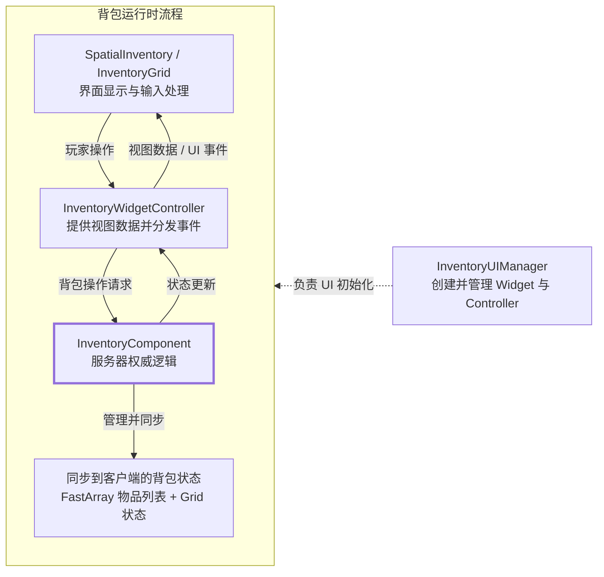

# Aura | UE 5.6 GAS 俯视角 Action RPG Systems Prototype

[English](README.md) | **简体中文**

Aura 是一个基于 **Unreal Engine 5.6、C++ 和 Gameplay Ability System（GAS）** 的俯视角 Action RPG 项目, 项目主要强调战斗、角色成长、多人同步、UI 和运行时性能相关features的实现。

## 演示

### Gameplay

  

视频链接：[Aura Gameplay Systems Demo](https://youtu.be/y_uQL8ulQLg)

### Inventory

  

视频链接：[Replicated Spatial Inventory Update](https://www.youtube.com/watch?v=ghusU05mUH0)

## 我的贡献

### 课程之外的扩展

除了课程内容，我还做了这些调整：

- 在课程的 spatial inventory 基础上重构了背包架构，把物品数据、服务器操作、网格状态和 UI 拆开。新增的 `InventoryGridManager`、`InventoryUIManager` 与 `InventoryWidgetController` 让 Widget 只负责显示和输入，不再保存权威状态。
- 编写了基于 `UWorldSubsystem` 的 `SimpleObjectPool` 插件，支持配置预创建、按需扩容、手动回收和延时回收。池化投射物在复用前会重置碰撞、移动、追踪、音效与伤害状态。
- 将课程中的 Click-to-Move 逻辑封装进独立的 `AutoMoveComponent`。短按地面时由服务器计算路径并同步给客户端；按住鼠标时直接移动，同时处理请求取消和过期路径。
- 扩展了角色构筑 UI。Attribute Menu 支持本地预览、逐点撤销、确认提交和关闭回滚；Spell Menu 使用“选择技能 → 选择兼容槽位”的两阶段装备流程。两个菜单都支持拖动、实例缓存和重复开关。
- 增加 Health/Mana 拾取提示和镜头遮挡淡化，让玩家在俯视视角下更容易看清角色和状态变化。

### 课程项目与 UE 5.6 迁移

Aura 的核心系统基于 [*Unreal Engine 5 - Gameplay Ability System - Top Down RPG*](https://www.udemy.com/course/unreal-engine-5-gas-top-down-rpg/)。我跟随课程完成了 GAS 战斗、技能、成长、AI 和 UI，并把项目迁移到 **UE 5.6**。

- 搭建 `AbilitySystemComponent`、`AttributeSet`、`GameplayTags`、`InputTag` 输入，以及 `GameplayEffect` 的 Cost、Cooldown 与 Attribute 复制流程。
- 实现 **FireBolt、Electrocute、Arcane Shards** 3 个主动技能，以及 **Halo of Protection、Life Siphon、Mana Siphon** 3 个可装备被动技能。
- 构建数据驱动的伤害管线，覆盖四种伤害与抗性、护甲穿透、格挡、暴击、Debuff、击退、死亡冲量、范围伤害和 XP 奖励。
- 完成 XP/Level、Attribute Points、Spell Points，以及 **Locked → Eligible → Unlocked → Equipped** 的技能书状态流转。
- 搭建 Elementalist、Warrior、Ranger 敌人框架，并通过 Behavior Tree 支持近战、远程、Enemy FireBolt 和 Summon。
- 使用 `WidgetController` 与 Delegate 串联 Health、Mana、XP、技能槽、技能书、Attribute Menu 和拾取反馈 UI。

课程使用的是较早的 UE5 版本，部分 API 在 UE 5.6 中已经发生变化。我在实现过程中查阅官方文档和引擎接口，逐项处理了这些差异。

例如，Dynamic Spec Source Tags 需要通过 `GetDynamicSpecSourceTags()` 访问，运行时 `GameplayEffect` 的目标 Tags 改用 `UTargetTagsGameplayEffectComponent`。我还补全了自定义 `GameplayEffectContext` 的 `NetSerialize` 和深拷贝，使格挡、暴击、Debuff、击退与死亡冲量等数据可以正确复制。

## 架构与性能测试

### Replicated Spatial Inventory

背包最初基于 [*Unreal Engine 5 C++ Inventory Systems*](https://www.udemy.com/course/unreal-engine-5-inventory-systems/) 实现。随着交互和同步逻辑增加，我把玩法数据、服务器验证、网络复制和 UI 生命周期拆开。现在 Widget 只负责显示与输入，所有背包修改都交给 `InventoryComponent` 在服务器验证。

<strong>查看各层职责</strong>

- **`FInvSS_ItemManifest` / `UInvSS_InventoryItem`：** 定义物品类型、Fragments、尺寸和堆叠规则，并保存运行时实例数据。
- **`FInvSS_FastArray`：** 增量复制物品列表，并处理客户端新增/移除回调。
- **`UInvSS_InventoryComponent`：** 服务器权威入口，验证拾取、丢弃、使用、拆分、拖放和交换请求。
- **`UInvSS_InventoryGridManager`：** 保存各类别网格配置、槽位占用、父槽位、堆叠数量和复制修订版本。
- **`UInvSS_InventoryUIManager`：** 管理本地菜单、Controller、提示框、操作弹窗和物品说明窗口的生命周期。
- **`UInvSS_InventoryWidgetController`：** 将复制状态转换为 View Data 与 Delegate，并向玩法层转发玩家请求。
- **`UInvSS_SpatialInventory` / `UInvSS_InventoryGrid`：** 只负责类别切换、网格渲染、拖放预览和输入收集。

### 对象池测试

测试使用 FireBolt，对 Spawn/Destroy 和对象池复用分别执行 **5 轮 × 500 个 Actor**。计时结果与 Unreal Insights 导出的 CPU scopes 一致。

| Metric | Spawn / Destroy | Object Pool | Result |
|---|---:|---:|---:|
| Acquire Total | 872.717 ms | 62.426 ms | **降低 92.8%** |
| Release Total | 138.005 ms | 22.615 ms | **降低 83.6%** |
| Runtime Total | 1010.722 ms | 85.041 ms | **降低 91.6%** |
| Including Cold Setup | 1010.722 ms | 191.893 ms | **降低 81.0%** |

完整配置、逐轮结果和 Insights 数据：[ObjectPool Benchmark](Plugins/SimpleObjectPool/TestResults/ObjectPoolBenchmark.md)

## 功能与源码（Feature → Source Code）

| Feature | 主要实现入口 |
|---|---|
| **GAS 与 InputTag** | [ASC.h](Source/Aura/Public/Components/AbilitySystem/AuraAbilitySystemComponent.h)、[ASC.cpp](Source/Aura/Private/Components/AbilitySystem/AuraAbilitySystemComponent.cpp)、[GameplayTags](Source/Aura/Private/AuraGameTagManager.cpp)、[InputComponent](Source/Aura/Public/Input/AuraInputComponent.h) |
| **Attributes 与成长** | [AttributeSet](Source/Aura/Public/Components/AbilitySystem/AuraAttributeSet.h)、[PlayerState](Source/Aura/Public/Player/AuraPlayerState.h)、[LevelUpInfo](Source/Aura/Public/Components/AbilitySystem/Data/LevelUpInfo.h) |
| **伤害与 Effect Context** | [Damage Ability](Source/Aura/Private/Components/AbilitySystem/Ability/AuraDamageGameplayAbility.cpp)、[ExecCalc](Source/Aura/Private/Components/AbilitySystem/ExecCalc/ExecCalc_Damage.cpp)、[Effect Context](Source/Aura/Public/AuraAbilityTypes.h)、[NetSerialize](Source/Aura/Public/AuraAbilityTypes.cpp) |
| **主动技能** | [FireBolt](Source/Aura/Private/Components/AbilitySystem/Ability/AuraFireBolt.cpp)、[Electrocute](Source/Aura/Private/Components/AbilitySystem/Ability/Electrocute.cpp)、[Arcane Shards](Source/Aura/Private/Components/AbilitySystem/Ability/ArcaneShard.cpp) |
| **被动技能** | [Passive Ability](Source/Aura/Private/Components/AbilitySystem/Ability/AuraPassiveAbility.cpp)、[Passive Niagara](Source/Aura/Private/Components/AbilitySystem/Passive/PassiveNiagaraComponent.cpp) |
| **技能书与技能成长** | [ASC](Source/Aura/Private/Components/AbilitySystem/AuraAbilitySystemComponent.cpp)、[AbilityInfo](Source/Aura/Public/Components/AbilitySystem/Data/AbilityInfo.h)、[Spell Menu Controller](Source/Aura/Private/UI/WidgetController/AuraSpellMenuWidgetController.cpp) |
| **敌人 AI 与召唤** | [Enemy](Source/Aura/Private/Character/AuraEnemy.cpp)、[AI Controller](Source/Aura/Private/AI/AuraAIController.cpp)、[Summon Ability](Source/Aura/Private/Components/AbilitySystem/Ability/AuraSummonAbility.cpp) |
| **多人 Click-to-Move** | [AutoMoveComponent.h](Source/Aura/Public/Components/Player/AutoMoveComponent.h)、[AutoMoveComponent.cpp](Source/Aura/Private/Components/Player/AutoMoveComponent.cpp)、[PlayerController](Source/Aura/Private/Player/AuraPlayerController.cpp) |
| **UMG / WidgetController** | [WidgetController](Source/Aura/Public/UI/WidgetController/AuraWidgetController.h)、[Overlay Controller](Source/Aura/Private/UI/WidgetController/AuraOverlayWidgetController.cpp)、[AuraUserWidget](Source/Aura/Public/UI/Widget/AuraUserWidget.h) |
| **Attribute / Spell Menu** | [Attribute Controller](Source/Aura/Private/UI/WidgetController/AttributeMenuWidgetController.cpp)、[Spell Controller](Source/Aura/Private/UI/WidgetController/AuraSpellMenuWidgetController.cpp)、[HUD Window Cache](Source/Aura/Private/UI/HUD/AuraHUD.cpp) |
| **背包数据与复制** | [Item Manifest](Plugins/InventorySystem/Source/InventorySystem/Public/Item/Manifest/InvSS_ItemManifest.h)、[Inventory Item](Plugins/InventorySystem/Source/InventorySystem/Public/Item/InvSS_InventoryItem.h)、[FastArray](Plugins/InventorySystem/Source/InventorySystem/Public/InventoryManagement/FastArray/InvSS_FastArray.h) |
| **背包服务器逻辑** | [Inventory Component](Plugins/InventorySystem/Source/InventorySystem/Private/InventoryManagement/Component/InvSS_InventoryComponent.cpp)、[Grid Manager](Plugins/InventorySystem/Source/InventorySystem/Private/InventoryManagement/Grid/InvSS_InventoryGridManager.cpp) |
| **背包 UI 分层** | [UI Manager](Plugins/InventorySystem/Source/InventorySystem/Private/Widgets/HUD/InvSS_InventoryUIManager.cpp)、[WidgetController](Plugins/InventorySystem/Source/InventorySystem/Private/Widgets/WidgetController/InvSS_InventoryWidgetController.cpp)、[Grid Render](Plugins/InventorySystem/Source/InventorySystem/Private/Widgets/Inventory/InventorySpatial/InvSS_InventoryGrid_Render.cpp)、[Grid Interaction](Plugins/InventorySystem/Source/InventorySystem/Private/Widgets/Inventory/InventorySpatial/InvSS_InventoryGrid_Interaction.cpp) |
| **对象池与池化投射物** | [Pool Subsystem](Plugins/SimpleObjectPool/Source/SimpleObjectPool/Private/ObjectPoolSubsystem.cpp)、[Pooled Gameplay Actor](Source/Aura/Private/Effect/AuraPooledGameplayActor.cpp)、[Projectile Reset](Source/Aura/Private/Effect/AuraProjectile.cpp)、[Benchmark](Plugins/SimpleObjectPool/TestResults/ObjectPoolBenchmark.md) |

## 运行项目

### 运行环境

- Windows 与 **Unreal Engine 5.6**。
- Git LFS，用于同步大型 Unreal assets。
- Visual Studio 2022 C++ toolchain（仓库提供 `.vsconfig`），或配置好 Unreal Engine 支持的 Rider。

### 步骤

1. 首次使用 Git LFS 时，执行 `git lfs install`。
2. 克隆仓库后执行 `git lfs pull`，确保所有 `.uasset` 和媒体文件完整下载。
3. 右键 `Aura.uproject`，生成 IDE 项目文件。
4. 使用 **Development Editor** 配置编译 `AuraEditor` target。
5. 打开 `Aura.uproject`，从 Editor 运行项目。

## 课程与贡献说明

- Aura 核心系统课程：[*Unreal Engine 5 - Gameplay Ability System - Top Down RPG*](https://www.udemy.com/course/unreal-engine-5-gas-top-down-rpg/)，Stephen Ulibarri
- Inventory 系统课程：[*Unreal Engine 5 C++ Inventory Systems*](https://www.udemy.com/course/unreal-engine-5-inventory-systems/)，Stephen Ulibarri
